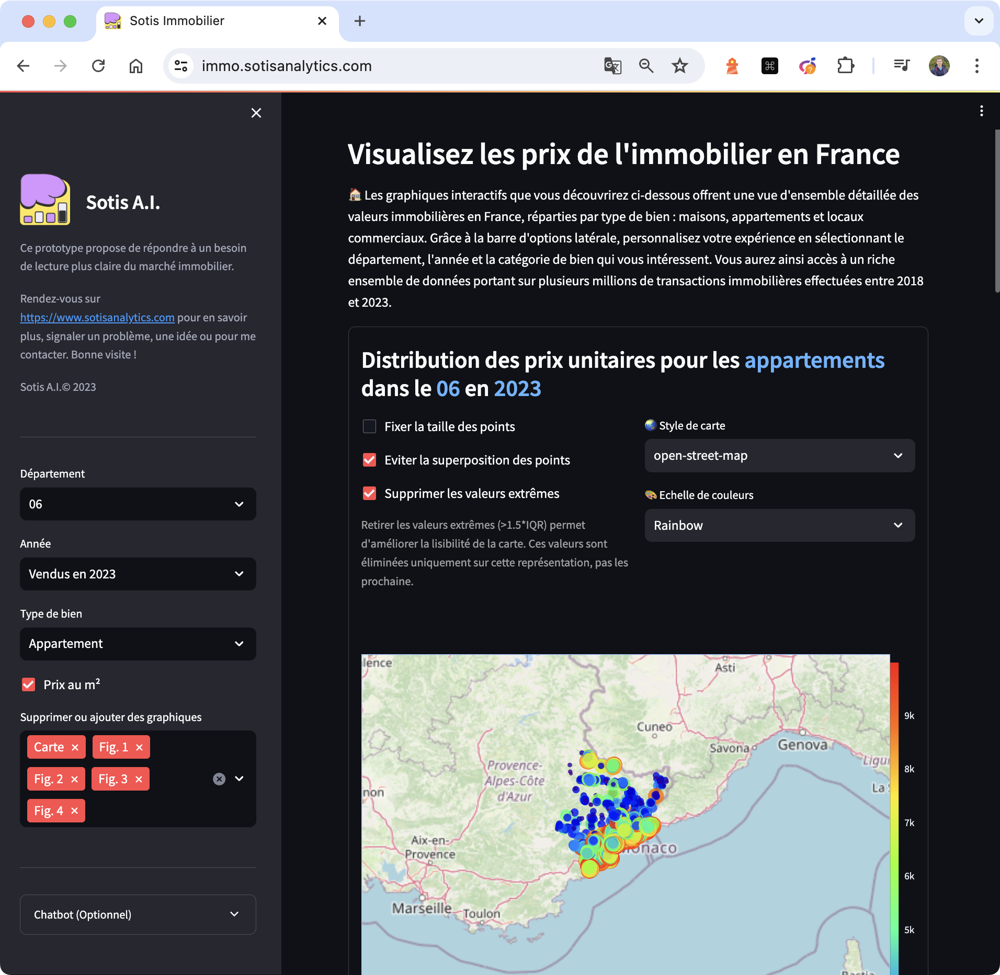

# Interactive Analysis of the French Real Estate Park Over Time

## 📄 Description

🏡 Discover an application to explore the French real estate market.

🤔 “How much does accommodation cost in my city? In my neighborhood?” These are questions that I have often asked myself. And to my great surprise, it was difficult to find clear and precise answers, in agencies or on the internet. That's why I created this tool.

Here's a little app that lets you dive into real estate transactions in France from 2018 to today. Use customizable filters to analyze market trends by region, year and property type. An ideal tool for individuals and professionals who wish to have an overview of the real estate market.

🌐 Access the app and start your exploration now at [https://immo.sotisanalytics.com](https://immo.sotisanalytics.com).

|  |  |
|:---------------------:|:---------------------:|
|Pipeline|Application|

---

## Prerequisites
- Anaconda or Miniconda
- Docker (for Docker deployment)

---

## ⚒️ Installation

### Prerequisites
- Python 3.11
- Python libraries
    ```sh
    pip install -r requirements.txt
    ```

---

## 📝 Usage

### Running without Docker

1. **Clone the repository and navigate to directory**
    ```bash
    git pull https://github.com/LudovicGardy/app_sotisimmo
    cd sotisimmo_repos/app_folder
    ```

2. **Environment setup**
    - Create and/or activate the virtual environment:
        ```bash
        conda create -n myenv python=3.11
        conda activate myenv
        ```
        or
        ```bash
        source .venv/bin/activate
        ```

3. **Launch the Streamlit App**
    - Run the Streamlit application:
        ```bash
        streamlit run main.py
        ```

### Running with Docker

1. **Prepare Docker environment**
    - Ensure Docker is installed and running on your system.

2. **Navigate to project directory**
    - For multiple containers:
        ```bash
        cd [path-to-app-folder-containing-docker-compose.yml]
        ```
    - For a single container:
        ```bash
        cd [path-to-app-folder-containing-Dockerfile]
        ```

3. **Build the image (if does not already exist)**
    - For multiple containers:
        ```bash
        docker-compose up --build
        ```
    - For a single container:
        ```bash
        docker build -t my-app-title .
        ```

4. **Run the containers**
    - For multiple containers:
        ```bash
        docker run -p 8501:8501 my-app-title
        ```
    - The application will be accessible at `http://localhost:8501`.

5. **Other notes**
    - ⚠️ If you encounter issues with `pymssql`, adjust its version in `requirements.txt` or remove it before building the Docker image.
    - ⚠️ If you encounter issues with `pyspark`, you might need to uninstall and reinstall it. Additionally, ensure that Java is installed and properly configured on your system, as `pyspark` depends on Java. You can install Java by following the instructions on the [official Java website](https://www.java.com/en/download/help/download_options.html). Make sure to set the `JAVA_HOME` environment variable to point to your Java installation directory.

---

## 👤 Author
- LinkedIn: [Ludovic Gardy](https://www.linkedin.com/in/ludovic-gardy/)
- Website: [https://www.sotisanalytics.com](https://www.sotisanalytics.com)